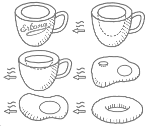

# lmug

*LFE HTTP Server Abstraction and Web Application Middleware
Infrastructure*




## Introduction

lmug is an LFE web applications library inspired by
[Clojure's Ring](https://github.com/ring-clojure/ring) (and thus,
indirectly, by
[Python's WSGI](http://legacy.python.org/dev/peps/pep-3333/)).

lmug allows web applications to be constructed of modular components
that can be shared among a variety of applications -- regardless of
which web server or web framework is used. This is possible by providing
a standard abstraction for two things:

* Erlang/LFE/BEAM HTTP servers, and
* functions that can sit between the HTTP request and the HTTP response.

The [SPEC](doc/SPEC.md) file, copied directly from the Clojure Ring
project, provides a complete description of the lmug interface.


### Why?

Using lmug as the basis for your web application has a number of
benefits:

* Write your application using LFE functions and records
* Run your application in a auto-reloading development server
* Take advantage of pre-written middleware
* More easily deploy your application in cloud environments like Amazon
  Elastic Beanstalk and Heroku
* Swap out the underlying HTTP server without changing any of your code

If all goes well, lmug will be the current de facto standard base from
which to write web applications in LFE. Higher level frameworks could
then use lmug as a common basis.

Even though lmug provides only a low-level interface, it is useful to
understand how it works even if you plan to use a higher-level interface.
Without a basic understanding of lmug, you cannot write middleware, and
you may find debugging your application more difficult.


## Installation

Just add it to your ``rebar.config`` deps:

```erlang
{deps, [
    ...
    {lmug, ".*", {git, "git@github.com:lfe-mug/lmug.git", "master"}}
  ]}.
```

And then do the usual:

```bash
$ rebar3 compile
```


## Usage

NOTE: the code in this section doesn't work yet! One of the first goals
is to get to this point :-)

NOTE: barista is a stand-alone demo HTTP server that is inlcuded with
lmug. It is an lmug wrapper around the OTP ``httpd`` server.

The usage examples below are done from the REPL:

```bash
$ make repl
```


### Simple Example

Ordinarily you would use lmug middleware in a project that was running a
supported web server and which included the lmug adaptor for that web server.
Below is an example showing similar to what you would have in a lmug web
application. If you are familiar with Clojure's Ring, then this will look
*very* familiar (though with a Lisp-2 flavor ...):

```lisp
(include-lib "clj/include/compose.lfe")

(defun identity-handler (handler)
  handler)

(set chain (-> (lmug:response)
               (identity-handler)
               (lmug-mw-content-type:wrap)
               (identity-handler)))
```

Then, to run it, simply do the following:

```lisp
> (funcall chain (lmug:request '(#(uri "http://localhost/file.json"))))
#(response 200 (#("Content-Type" "application/json")) ())
```


## Details


### Handlers

lmug handlers are functions that define your web application. They take
one argument, a map representing a HTTP request, and return a map
representing the HTTP response. The handlers return a record that can
then be translated by the supporting HTTP server adatper code into the
appropriate form that will allow the configured HTTP server (e.g., YAWS,
Cowboy, OTP httpd, etc.) to return an HTTP response.


### Middleware

lmug middleware are higher-level functions that add additional
functionality to handlers. The first argument of a middleware function
should be a handler, and its return value should be a new handler
function.


## lmug?

What's with the name? Well, there was lfest ... the web app routing
party. What would be at an LFE routing party? Lots of mugs, I guess.
Full of tastey, hot LFE.

Also, a mug is topologically equivalent to a ring. An lmug even more so.

Besides, lhorse just sounds weird.
